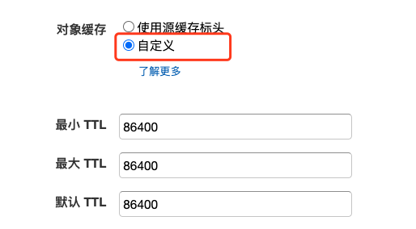

# CloudFront 预热脚本

[CloudFront](https://aws.amazon.com/cn/cloudfront/?nc2=h_ql_prod_nt_cf) 为 AWS 的 CDN 服务。此脚本用于做 CloudFront 的预热。

CDN 已经为一项成熟且广泛应用的技术，其原理为 CDN POP 节点会缓存用户的请求，当下次附近的终端用户访问时，通过 PoP 点中的缓存直接返回内容，从而提高网站响应速度。
但当文件第一次被请求时，PoP 点是肯定没有缓存这个文件的，仍然需要到源站去请求。因此，首批请求此文件的用户可能会有比较慢的体验，不排除他们选择因此离开页面的可能性。对于一些视频网站来讲，这种痛点往往会更强烈。

此文提出针对解决这个问题的办法，即通过脚本把文件提前缓存到各个PoP点上。它的原理为向您需要的每个Pop点发起请求并做本地下载，请求成功后，此文件就缓存到您选择的这些 Pop 点上了。
对于一些流媒体的视频网站，文件量非常大，通常不需要预热所有的文件，只需要预热新影片片头的一些分片文件即可。

## 免责声明

建议测试过程中使用此方案，生产环境使用请自行考虑评估。    
当您对方案需要进一步的沟通和反馈后，可以联系 nwcd_labs@nwcdcloud.cn 获得更进一步的支持。     
欢迎联系参与方案共建和提交方案需求, 也欢迎在 github 项目 issue 中留言反馈 bugs。     

## 前提条件        
1. 请先保证您的 CloudFront 配置正确，如源，权限等，确保 CloudFront 首先能够正常的对外提供 web 服务的加载。
1. 如果是普通静态缓存，请务必注意在 **行为** 这一tab中，配置对象缓存为自定义标头，否则如果在 request 当中没有添加 Cache-Control 的情况下，**CloudFront每次都会重新回源拿object**，预热是无效的。详细信息请参考[此官方文档的解释](https://docs.aws.amazon.com/AmazonCloudFront/latest/DeveloperGuide/Expiration.html)     
   
1. 中国区的 CloudFront，务必要添加备案过的 CNAME 才可以正常创建 distribution。
1. **此脚本无法保证 100% 的对象可以缓存成功**。   
   
## 原理    
普通的 CloudFront 请求会始终被路由到离用户最近的 PoP 点，因此您在本地的请求，只会预热到一个单一的 PoP 点上。
此脚本通过像指定的 POP 点发起请求的方式，直接将请求 request 到对应的PoP点上，因此您只需要一台 PC，就可以实现多节点的预热。
为了确保 cloudfront 可以成功的cache对象文件，此脚本会完整的下载您的对象文件并且在完成后自动删除掉。

## 适用场景    
1. 新上线的视频文件的开头分片文件
1. 新上线网站的一些图片/css文件等
1. 其他希望提前缓存住特定对象的场景。

## 使用方法     
**1. 根据需求选择 PoP点**           
根据自己的需求，选择 PoP 点。CloudFront 在中国有4个节点（北京，宁夏中卫，深圳，上海），但在海外有 200+ 个节点，当我们做预热时，其实不需要将每个节点都预热到，只需要预热我们需要针对的终端用户所在位置即可。
比如如果您的 target user 为东南亚，只需要预热东南亚部分；同理，如果 target 在美国，只需要预热美国节点。
AWS 官方虽然没有对应的页面列出所有的 PoP 点的 code，但从一些第三方网站如[此网站](https://www.feitsui.com/zh-hans/article/3) 可以找到。
选择对应的 PoP code 并且生成 csv 文件。
> 注：中国区 Cloudfront 请用中国区的 POP Code，海外区 Cloudfront 请用海外的 PoP Code 。
> 示例文件 pops.csv 当中只包含三个example POP code，请根据自己的需求做相应添加。

**2. 定义所需要预热的路径**     
   在 file.txt 中列出文件路径，或者是完整的访问连接。如：
   ```
   /btt1/2020/03/20200303/QoQQjVr1/2000kb/hls/XoLJyjuz.ts
   /btt1/2020/03/20200303/QoQQjVr1/2000kb/hls/1P5WgkfH.ts
   ```

或者是
   ```
   https://example.com/btt1/2020/03/20200303/QoQQjVr1/2000kb/hls/XoLJyjuz.ts
   https://example.com/btt1/2020/03/20200303/QoQQjVr1/2000kb/hls/1P5WgkfH.ts
   ```

**3. 参数定义**     
在 ``__prewarm_update.py`` 中修改以下参数为您自己的参数。
```
# 您的实际的自定义域名。如果您有CNAME,则填写您的实际CNAME(xxx.example.com)，如无，则domain是xxx.cloudfront.net
# 另外，中国区的Cloudfront，只能填写备案过的CNAME名称，否则无法正常创建distribution
domain = "example.com"  
cdn_name = 'xxxxxx.cloudfront.net'
```

另外还有一处 ``f1=open("test.jpg", "wb")``，此处如果您的对象文件尾缀固定，可以相应的修改您的对象文件为正确的尾缀内容。如果不固定则忽略。

**4.运行脚本**    
通过 ```python3 __prewarm_update.py``` 运行此脚本。

**5.检查日志**     
脚本会产生两个日志，一个是result.csv，完整记录每个请求的response；另一个是no_ip_file.csv，记录没有被成功解析的请求。
如果在请求当中出现了'miss from cloudfront', 则此 object 没有成功预热，可以重新运行脚本单独重新请求这些文件。

## 说明
1. **此脚本无法保证 100% 的对象可以缓存成功**。
1. 请勿滥用资源，合理的将需要集中访问的文件打到 PoP 点即可，不需要的资源，不必预热。


## 自定义
如果您的 list 文件不同于样例中所示的格式，或者您有其它自定义要求，可以根据此脚本加以自定制。
